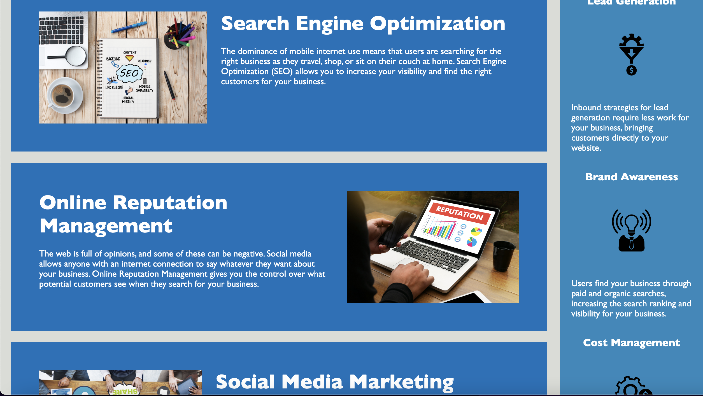

# 📖 Code Refactor

* AS A marketing agency I want a codebase that follows accessibility standards so that our own site is optimized for search engines.

## Acceptance Criteria

A webpage meets accessibility standards  
* WHEN I view the source code  
* THEN I find semantic HTML elements
* WHEN I view the structure of the HTML elements
* THEN I find that the elements follow a logical structure independent of styling and positioning
* WHEN I view the image elements
* THEN I find accessible alt attributes
* WHEN I view the heading attributes
* THEN they fall in sequential order
* WHEN I view the title element
* THEN I find a concise, descriptive title

## Final Result Screenshots
 

### Code Source
[starter code repository reference](https://github.com/coding-boot-camp/urban-octo-telegram)
<!---ADD YOUR SOURCE CODE!!! /!---> 
